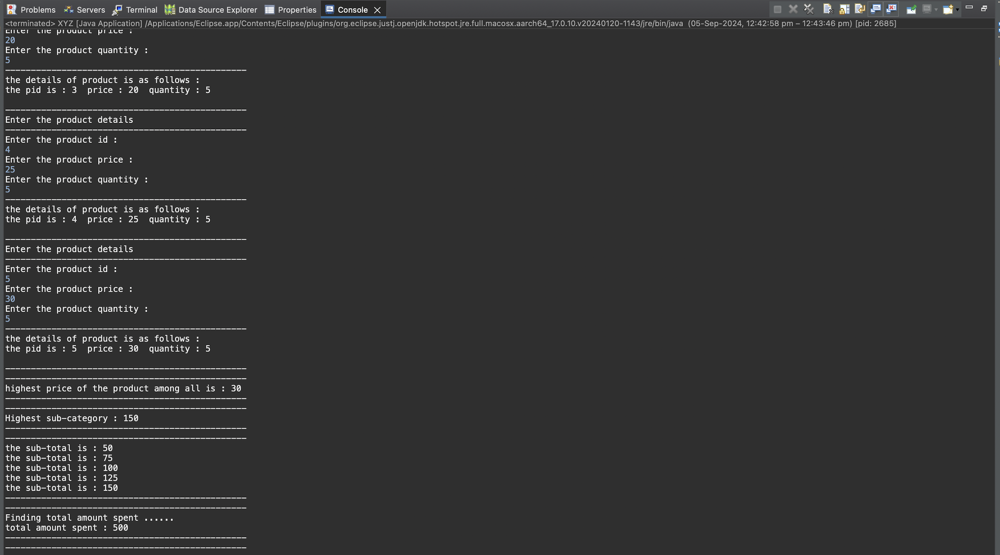
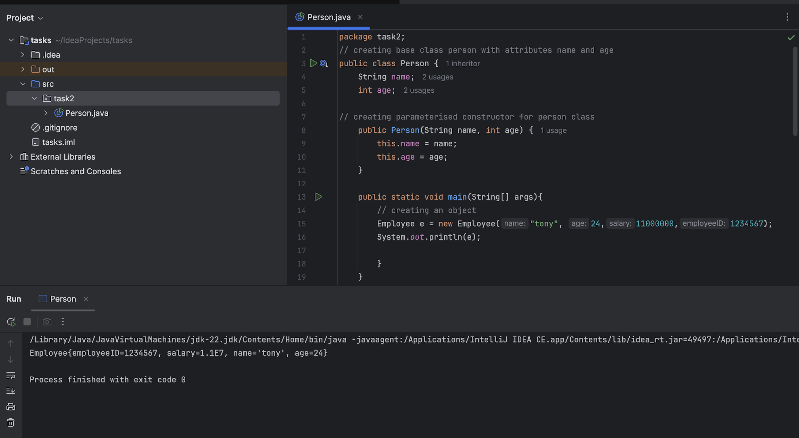

# Java OOP Fundamentals


This repository contains Java programs demonstrating fundamental Object-Oriented Programming (OOP) concepts such as encapsulation, inheritance, and basic class design. It includes four tasks (1.1 to 1.4), each illustrating a different OOP principle.

## 📁 Project Structure
```
src/
├── Account.java
├── Person.java
├── Person_2.java
├── Product.java
├── XYZ.java
└── screenshots/
    ├── 1.1.png
    ├── 1.2.a.png
    ├── 1.2.b.png
    ├── 1.3.png
    └── 1.4.png
```

## 📝 Task Overviews

### **Task 1.1 — Person Class**
- Implements a `Person` class with `name` and `age`.
- Default age is **18**.
- Includes constructor + method to display info.

▶️ **Screenshot:**  


---

### **Task 1.2 — Product Class**
- Represents products with `pid`, `price`, and `quantity`.
- `ProductMain`:
  - Accepts **5 products**.
  - Finds **highest price product**.
  - Calculates **total expenditure**.

▶️ **Screenshots:**  



---

### **Task 1.3 — Account Class**
- Implements `deposit`, `withdraw`, and `display` methods.
- Includes default + parameterized constructors.

▶️ **Screenshot:**  


---

### **Task 1.4 — Inheritance (Person → Employee)**
- `Employee` extends `Person`.
- Adds `employeeID` and `salary`.
- Uses `super()` for parent initialization.

▶️ **Screenshot:**  


---

## ▶️ Running the Programs

### **1. Clone the Repository**
```bash
git clone https://github.com/TheComputationalCore/java-oop-fundamentals.git
cd java-oop-fundamentals/src
```

### **2. Compile**
```bash
javac *.java
```

### **3. Run (examples)**
```bash
java Person
java Product
java Account
java XYZ
```

---

## 📦 Requirements
- Java JDK **8 or higher**
- Any terminal or Java IDE

---

## 📄 License  
This project is licensed under the MIT License.
